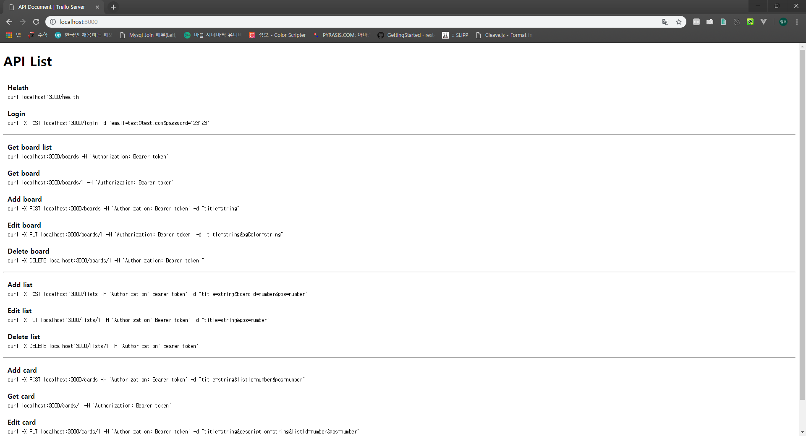

# vue-trello-api-server

## My Environment

* Windows 10

```shell
$ npm -v
5.5.1

$ node -v
v8.9.3
```

## Start

```dshell
npm install
npm run dev
```
Then, when we access localhost:3000 using browser, we will see the following screen.

